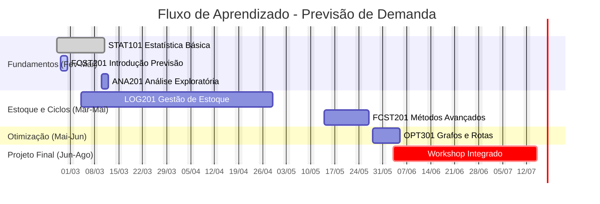

import { Badge, Aside } from '@astrojs/starlight/components';

Este cronograma utiliza uma abordagem de **aprendizado entrelaçado**, onde conceitos fundamentais (Estatística) são imediatamente aplicados em métodos de previsão e gestão de estoque na mesma diária, reforçando a retenção do conhecimento.

## Visualização da Trilha

<Aside type="caution" title="Planejamento de Carga Horária (Regra dos 70%)">
Para garantir a qualidade do ensino, cada bloco de 50 minutos possui aproximadamente **35 minutos de conteúdo expositivo planejado**. O tempo restante é dedicado a dúvidas, setup de ferramentas e pausas cognitivas.
</Aside>

## Calendário Detalhado

### Módulo 1: Fundamentos e Primeiros Modelos

| Data | Horário | Matéria | Tópico | Tipo |
| :--- | :------ | :------ | :---------------------------------------- | :--- |
| **25/02 (Qua)** | 08:00 - 08:50 | [STAT101](./stat101) | **Conceito**: Medidas de Tendência Central (Média, Mediana) | <Badge text="Teoria+Prática" variant="note" /> |
| | 09:00 - 09:50 | [FCST201](./fcst201) | **Aplicação**: O método de Médias Móveis Simples | <Badge text="Teoria+Prática" variant="tip" /> |
| | 10:00 - 10:50 | [EXL101](./exl101) | **Ferramenta**: Construindo previsão por média no Excel | <Badge text="Lab" variant="success" /> |
| | 11:00 - 11:30 | - | *Encerramento e Tira-dúvidas* | - |
| | **Tarde** | | | |
| | 13:00 - 13:50 | [STAT101](./stat101) | **Conceito**: Dispersão (Desvio Padrão) e Normal | <Badge text="Teoria" variant="note" /> |
| | 14:00 - 14:50 | [LOG201](./log201) | **Aplicação**: Estoque de Segurança (protegendo da variação) | <Badge text="Teoria+Prática" variant="tip" /> |
| | 15:00 - 15:50 | [EXL101](./exl101) | **Ferramenta**: Calculadora de Estoque de Segurança | <Badge text="Lab" variant="success" /> |

---

### Módulo 2: Análise de Dados e Ciclos

| Data | Horário | Matéria | Tópico | Tipo |
| :--- | :------ | :------ | :---------------------------------------- | :--- |
| **04/03 (Qua)** | 08:00 - 08:50 | [STAT101](./stat101) | **Conceito**: Outliers e Hipótese Nula (Intuição) | <Badge text="Teoria" variant="note" /> |
| | 09:00 - 09:50 | [ANA201](./ana201) | **Aplicação**: EDA - Identificando anomalias na demanda | <Badge text="Prática" variant="tip" /> |
| | 10:00 - 10:50 | [LOG201](./log201) | **Visualização**: Padrão Dente de Serra (Ciclos de estoque) | <Badge text="Teoria" variant="note" /> |
| | 11:00 - 11:30 | - | *Discussão de Caso Real* | - |
| | **Tarde** | | | |
| | 13:00 - 13:50 | [LOG201](./log201) | **Conceito**: Ponto de Reposição (Quando pedir?) | <Badge text="Teoria" variant="note" /> |
| | 14:00 - 14:50 | [FCST201](./fcst201) | **Impacto**: Erro de Previsão vs. Ruptura de Estoque | <Badge text="Teoria+Prática" variant="tip" /> |
| | 15:00 - 15:50 | Workshop | **Simulação**: O custo da falta (Stockout game) | <Badge text="Dinâmica" variant="success" /> |

---

### Módulo 3: Sazonalidade e Segmentação

| Data | Horário | Matéria | Tópico | Tipo |
| :--- | :------ | :------ | :---------------------------------------- | :--- |
| **18/03 (Qua)** | 08:00 - 08:50 | [STAT101](./stat101) | **Conceito**: Correlação e Causalidade | <Badge text="Teoria" variant="note" /> |
| | 09:00 - 09:50 | [ANA201](./ana201) | **Conceito**: Decomposição de Séries (Tendência/Sazonalidade) | <Badge text="Teoria" variant="note" /> |
| | 10:00 - 10:50 | [FCST201](./fcst201) | **Aplicação**: Ajustando previsões para Sazonalidade | <Badge text="Prática" variant="tip" /> |
| | 11:00 - 11:30 | - | *Encerramento* | - |
| | **Tarde** | | | |
| | 13:00 - 13:50 | [ANA201](./ana201) | **Conceito**: Princípio de Pareto (80/20) | <Badge text="Teoria" variant="note" /> |
| | 14:00 - 14:50 | [LOG201](./log201) | **Aplicação**: Curva ABC para Gestão de Estoque | <Badge text="Prática" variant="tip" /> |
| | 15:00 - 15:50 | [EXL101](./exl101) | **Ferramenta**: Construindo a Curva ABC no Excel | <Badge text="Lab" variant="success" /> |

---

### Módulo 4: Comunicação e Consolidação I

| Data | Horário | Matéria | Tópico | Tipo |
| :--- | :------ | :------ | :---------------------------------------- | :--- |
| **20/03 (Sex)** | 08:00 - 08:50 | [ANA201](./ana201) | **Conceito**: Visualização de Dados Eficiente | <Badge text="Teoria" variant="note" /> |
| | 09:00 - 09:50 | [ANA201](./ana201) | **Técnica**: Data Storytelling para Gestores | <Badge text="Prática" variant="tip" /> |
| | 10:00 - 10:50 | Workshop | **Atividade**: Apresentação de Resultados (Mock) | <Badge text="Dinâmica" variant="success" /> |
| | **Tarde** | - | *Livre (Sexta-feira)* | - |

---

### Módulo 5: Gestão de Suprimentos Avançada

| Data | Horário | Matéria | Tópico | Tipo |
| :--- | :------ | :------ | :---------------------------------------- | :--- |
| **01/04 (Qua)** | 08:00 - 08:50 | [LOG201](./log201) | **Revisão**: Parâmetros de Estoque (ROP, ES) | <Badge text="Revisão" variant="caution" /> |
| | 09:00 - 09:50 | [LOG201](./log201) | **Conceito**: Lead Time e Variabilidade de Fornecimento | <Badge text="Teoria" variant="note" /> |
| | 10:00 - 10:50 | [LOG201](./log201) | **Aplicação**: Impacto do Lead Time no ROP | <Badge text="Prática" variant="tip" /> |
| | **Tarde** | | | |
| | 13:00 - 13:50 | Workshop | Estudo de Caso: Ruptura na Base Aérea | <Badge text="Caso" variant="success" /> |
| | 14:00 - 14:50 | Workshop | Análise de Causa Raiz | <Badge text="Prática" variant="tip" /> |
| | 15:00 - 15:50 | Workshop | Apresentação de Soluções do Caso | <Badge text="Dinâmica" variant="success" /> |

---

### Módulo 6: Otimização de Níveis de Estoque

| Data | Horário | Matéria | Tópico | Tipo |
| :--- | :------ | :------ | :---------------------------------------- | :--- |
| **06/05 (Qua)** | 08:00 - 08:50 | [LOG201](./log201) | **Conceito**: Nível de Serviço (Significado Estatístico) | <Badge text="Teoria" variant="note" /> |
| | 09:00 - 09:50 | [LOG201](./log201) | **Aplicação**: Calculando Nível de Serviço Ótimo | <Badge text="Prática" variant="tip" /> |
| | 10:00 - 10:50 | [EXL101](./exl101) | **Ferramenta**: Tabela Dinâmica para Análise de Nível | <Badge text="Lab" variant="success" /> |
| | **Tarde** | | | |
| | 13:00 - 13:50 | [LOG201](./log201) | **Conceito**: Custo de Falta vs. Custo de Sobra | <Badge text="Teoria" variant="note" /> |
| | 14:00 - 14:50 | [LOG201](./log201) | **Aplicação**: Trade-offs gerenciais | <Badge text="Prática" variant="tip" /> |
| | 15:00 - 15:50 | Workshop | Debate: Risco vs. Custo na Força Aérea | <Badge text="Dinâmica" variant="success" /> |

---

### Módulo 7: Economia e Suprimento

| Data | Horário | Matéria | Tópico | Tipo |
| :--- | :------ | :------ | :---------------------------------------- | :--- |
| **07/05 (Qui)** | **10:00 - 10:50** | [LOG201](./log201) | **Conceito**: Curva de Suprimento | <Badge text="Teoria" variant="note" /> |
| | 11:00 - 11:30 | - | *Intro Prática Tarde* | - |
| | **Tarde** | | | |
| | 13:00 - 13:50 | [LOG201](./log201) | **Conceito**: Elasticidade Preço/Quantidade | <Badge text="Teoria" variant="note" /> |
| | 14:00 - 14:50 | [LOG201](./log201) | **Aplicação**: Análise de propostas de fornecedores | <Badge text="Prática" variant="tip" /> |
| | 15:00 - 15:50 | Workshop | Negociação baseada em dados | <Badge text="Simulação" variant="success" /> |

---

### Módulo 8: Lote Econômico e KPIs

| Data | Horário | Matéria | Tópico | Tipo |
| :--- | :------ | :------ | :---------------------------------------- | :--- |
| **13/05 (Qua)** | 08:00 - 08:50 | [LOG201](./log201) | **Conceito**: Custos de Pedido vs. Custos de Posse | <Badge text="Teoria" variant="note" /> |
| | 09:00 - 09:50 | [LOG201](./log201) | **Modelo**: EOQ (Lote Econômico de Compra) | <Badge text="Teoria" variant="note" /> |
| | 10:00 - 10:50 | [EXL101](./exl101) | **Ferramenta**: Calculadora EOQ e Sensibilidade | <Badge text="Lab" variant="success" /> |
| | **Tarde** | | | |
| | 13:00 - 13:50 | [LOG201](./log201) | **Conceito**: KPIs Logísticos (Giro, Cobertura) | <Badge text="Teoria" variant="note" /> |
| | 14:00 - 14:50 | [ANA201](./ana201) | **Aplicação**: Dashboard de KPIs de Estoque | <Badge text="Prática" variant="tip" /> |
| | 15:00 - 15:50 | Workshop | Análise de Saúde do Estoque (Dataset Real) | <Badge text="Dinâmica" variant="success" /> |

---

### Módulo 9: Previsão Avançada I

| Data | Horário | Matéria | Tópico | Tipo |
| :--- | :------ | :------ | :---------------------------------------- | :--- |
| **14/05 (Qui)** | **10:00 - 10:50** | [FCST201](./fcst201) | **Conceito**: Limitações da Média Móvel | <Badge text="Teoria" variant="note" /> |
| | 11:00 - 11:30 | [FCST201](./fcst201) | **Intro**: Média Móvel Ponderada | <Badge text="Teoria" variant="note" /> |
| | **Tarde** | | | |
| | 13:00 - 13:50 | [FCST201](./fcst201) | **Aplicação**: Definindo pesos para dados recentes | <Badge text="Prática" variant="tip" /> |
| | 14:00 - 14:50 | [EXL101](./exl101) | **Ferramenta**: Otimizando pesos no Excel (Solver Intro)| <Badge text="Lab" variant="success" /> |
| | 15:00 - 15:50 | Workshop | Competição de Previsão (Ponderada vs Simples) | <Badge text="Dinâmica" variant="success" /> |

---

### Módulo 10: Previsão Avançada II

| Data | Horário | Matéria | Tópico | Tipo |
| :--- | :------ | :------ | :---------------------------------------- | :--- |
| **21/05 (Qui)** | **10:00 - 10:50** | [FCST201](./fcst201) | **Conceito**: Suavização Exponencial Simples (SES) | <Badge text="Teoria" variant="note" /> |
| | 11:00 - 11:30 | - | *Intro Prática Tarde* | - |
| | **Tarde** | | | |
| | 13:00 - 13:50 | [FCST201](./fcst201) | **Aplicação**: O parâmetro Alpha | <Badge text="Prática" variant="tip" /> |
| | 14:00 - 14:50 | [EXL101](./exl101) | **Ferramenta**: Implementando SES no Excel | <Badge text="Lab" variant="success" /> |
| | 15:00 - 15:50 | [EXL101](./exl101) | **Ferramenta**: Solver para encontrar Alpha ótimo | <Badge text="Lab" variant="success" /> |

---

### Módulo 11: Qualidade da Previsão

| Data | Horário | Matéria | Tópico | Tipo |
| :--- | :------ | :------ | :---------------------------------------- | :--- |
| **22/05 (Sex)** | 08:00 - 08:50 | [FCST201](./fcst201) | **Conceito**: Métricas de Erro (MAD, MSE, MAPE) | <Badge text="Teoria" variant="note" /> |
| | 09:00 - 09:50 | [FCST201](./fcst201) | **Conceito**: Viés (Bias) de Previsão | <Badge text="Teoria" variant="note" /> |
| | 10:00 - 10:50 | Workshop | **Aplicação**: Diagnosticando modelos ruins | <Badge text="Prática" variant="tip" /> |
| | **Tarde** | - | *Livre* | - |

---

### Módulo 12: Introdução a Redes e Grafos

| Data | Horário | Matéria | Tópico | Tipo |
| :--- | :------ | :------ | :---------------------------------------- | :--- |
| **28/05 (Qui)** | **10:00 - 10:50** | [OPT301](./opt301) | **Conceito**: Teoria dos Grafos e Redes Logísticas | <Badge text="Teoria" variant="note" /> |
| | 11:00 - 11:30 | - | *Intro Prática Tarde* | - |
| | **Tarde** | | | |
| | 13:00 - 13:50 | [OPT301](./opt301) | **Aplicação**: Modelando problemas reais como grafos | <Badge text="Prática" variant="tip" /> |
| | 14:00 - 14:50 | [OPT301](./opt301) | **Ferramenta**: Matrizes de Adjacência e Custos | <Badge text="Lab" variant="success" /> |
| | 15:00 - 15:50 | Workshop | Desenhando a rede logística da Unidade | <Badge text="Dinâmica" variant="success" /> |

---

### Módulo 13: Algoritmos de Caminho Mínimo

| Data | Horário | Matéria | Tópico | Tipo |
| :--- | :------ | :------ | :---------------------------------------- | :--- |
| **29/05 (Sex)** | 08:00 - 08:50 | [OPT301](./opt301) | **Conceito**: Algoritmo de Dijkstra (Intuição) | <Badge text="Teoria" variant="note" /> |
| | 09:00 - 09:50 | [OPT301](./opt301) | **Aplicação**: Dijkstra passo-a-passo (Manual) | <Badge text="Prática" variant="tip" /> |
| | 10:00 - 10:50 | Workshop | Desafio de Roteirização Manual | <Badge text="Dinâmica" variant="success" /> |
| | **Tarde** | - | *Livre* | - |

---

### Módulo 14: Roteirização Computacional

| Data | Horário | Matéria | Tópico | Tipo |
| :--- | :------ | :------ | :---------------------------------------- | :--- |
| **01/06 (Seg)** | 08:00 - 08:50 | [OPT301](./opt301) | **Conceito**: Vehicle Routing Problem (VRP) | <Badge text="Teoria" variant="note" /> |
| | 09:00 - 09:50 | [OPT301](./opt301) | **Aplicação**: Restrições de Capacidade e Tempo | <Badge text="Prática" variant="tip" /> |
| | 10:00 - 10:50 | [EXL101](./exl101) | **Ferramenta**: Solver para VRP Simples | <Badge text="Lab" variant="success" /> |
| | **Tarde** | | | |
| | 13:00 - 13:50 | [OPT301](./opt301) | **Aplicação**: VRP com Múltiplos Veículos | <Badge text="Prática" variant="tip" /> |
| | 14:00 - 14:50 | [EXL101](./exl101) | **Ferramenta**: Otimização avançada no Excel | <Badge text="Lab" variant="success" /> |
| | 15:00 - 15:50 | Workshop | Laboratório de Otimização de Rota | <Badge text="Dinâmica" variant="success" /> |

---

### Módulo 15: Consolidação e Aplicações Militares

| Data | Horário | Matéria | Tópico | Tipo |
| :--- | :------ | :------ | :---------------------------------------- | :--- |
| **02/06 (Ter)** | **10:00 - 10:50** | [OPT301](./opt301) | **Conceito**: Casos de Uso Militar (Vacinas, Emergência) | <Badge text="Teoria" variant="note" /> |
| | 11:00 - 11:30 | - | *Intro Prática Tarde* | - |
| | **Tarde** | | | |
| | 13:00 - 13:50 | Workshop | Briefing do Projeto Final Integrado | <Badge text="Projeto" variant="danger" /> |
| | 14:00 - 14:50 | Workshop | Formação de Equipes e Definição de Escopo | <Badge text="Projeto" variant="danger" /> |
| | 15:00 - 15:50 | Workshop | Coleta de Dados Inicial | <Badge text="Projeto" variant="danger" /> |

---

### Módulo 16: Projeto Integrado - Parte I

| Data | Horário | Atividade | Foco |
| :--- | :------ | :-------- | :--- |
| **03/06 (Qua)** | 08:00 - 11:30 | Projeto Integrado | Dados Previsão de Demanda |
| | 13:00 - 16:00 | Projeto Integrado | Previsão Planejamento de Estoque |

---

### Módulo 17: Projeto Integrado - Parte II

| Data | Horário | Atividade | Foco |
| :--- | :------ | :-------- | :--- |
| **22/06 (Seg)** | 08:00 - 11:30 | Projeto Integrado | Estoque Distribuição (Rotas) |
| | 13:00 - 16:00 | Projeto Integrado | Consolidação em Dashboards e Relatório |

---

### Revisão e Exame

| Data | Horário | Atividade | Detalhe |
| :--- | :------ | :-------- | :------ |
| **14/07 (Ter)** | 10:00 - 16:00 | **Revisão Geral** | Manhã: Conceitos Chave / Tarde: Plantão de Dúvidas |
| **04/08 (Ter)** | 10:00 - 16:00 | **Avaliação Final** | **Prova Teórica e Apresentação do Projeto** |

