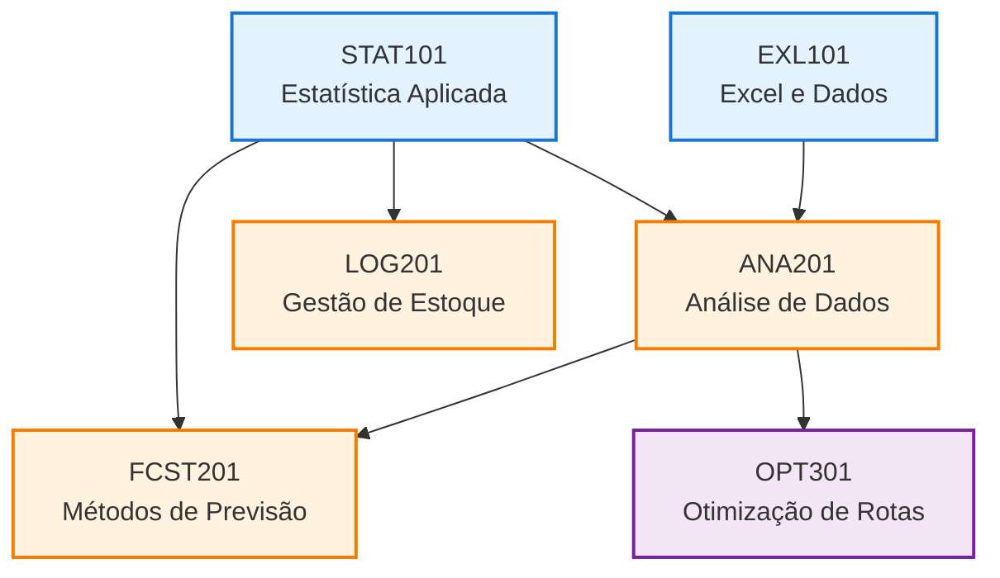

import { Steps, Aside } from '@astrojs/starlight/components';

A trilha de **Previsão de Demanda** é uma matéria essencial do CPAINT. O objetivo é capacitar o oficial a estimar necessidades futuras de suprimentos e serviços com base em dados, reduzindo desperdícios e evitando rupturas.

Esta trilha está incluída didaticamente dentro do módulo **"Especialização em Análise de Demanda"** previsto no [PPC](/cpaint/ppc/).

## Perfil do Aluno

### Estado Inicial
O discente típico desta trilha é um **Aspirante a Oficial Intendente da Força Aérea Brasileira** com as seguintes características:

**Pontos Fortes:**
- Amplo conhecimento sobre o regime de contratação da administração federal
- Familiaridade com processos e procedimentos administrativos militares

**Pontos de Desenvolvimento:**
- Conhecimento matemático limitado ao **nível médio**
- Exposição superficial a estatística, mas **sem compreensão de conceitos básicos** como valor-p e hipótese nula
- **Não** possui competência em:
  - Operações com matrizes
  - Indução matemática
  - Demonstrações formais

<Aside type="caution" title="Pré-requisitos Matemáticos">
Esta trilha foi **desenhada para não exigir pré-requisitos matemáticos avançados**. Todos os conceitos quantitativos são apresentados de forma aplicada e intuitiva, priorizando o uso de ferramentas computacionais.
</Aside>

### Estado Final (Competências Esperadas)
Ao concluir esta trilha, o oficial será capaz de:

1. **Dominar os principais métodos de previsão de demanda**  
2. **Compreender a dinâmica da demanda** e seus componentes (tendência, sazonalidade, aleatoriedade)  
3. **Calcular ponto de reposição**, lote econômico de compra e estoque de segurança  
4. **Analisar curvas de suprimento** e padrões dente de serra  
5. **Aplicar Curva ABC (Pareto)** para priorização de gestão  
6. **Realizar otimização de rotas** usando conceitos de grafos  
7. **Implementar análises práticas** usando Excel e Google Sheets
9. **Tomar decisões baseadas em dados** (Data Driven Decision Making), compreendendo trade-offs e riscos  

## Abordagem Pedagógica

Este curso segue uma progressão metodológica específica:

<Steps>

1. **Estatística como Base (STAT101)**

   A estatística fornece a fundamentação teórica necessária para compreender variabilidade, distribuições e incerteza. Sem essa base, os métodos de previsão não fazem sentido.

2. **Métodos de Previsão como Núcleo (FCST201)**

   Os métodos de previsão são o **coração do curso**. Aqui, o aluno aprende *como* prever: Média Móvel, Suavização Exponencial, Regressão, etc. Esses métodos aplicam diretamente os conceitos estatísticos aprendidos.

3. **Ferramentas como Aplicação (EXL101, DB101)**

   Excel e conceitos de dados estruturados são as **ferramentas de implementação**. O foco está em usar a ferramenta para executar os algoritmos aprendidos.

</Steps>

<Aside type="tip" title="Ordem de Estudo Recomendada">
Primeiro domine a teoria estatística, depois compreenda os métodos, e finalmente aplique-os usando as ferramentas. Esta sequência garante que você entenda o "porquê" antes do "como".
</Aside>  

## Progressão das Matérias

O diagrama abaixo mostra a sequência recomendada de estudo e os pré-requisitos entre as matérias:

## Matérias da Trilha

### Nível Introdutório (100)
Fundamentos sem pré-requisitos matemáticos avançados.

- **[EXL101 - Planilhas Eletrônicas para Negócios](./exl101)**: Domínio da ferramenta essencial e fundamentos de dados estruturados.
- **[STAT101 - Estatística Aplicada](./stat101)**: A base matemática necessária para entender incertezas e tendências.

### Nível Intermediário (200)
Aplicação prática dos fundamentos. Requer conclusão de matérias do nível 100.

- **[ANA201 - Análise de Dados](./ana201)**: Transformando dados em informações úteis para decisão (Curva ABC, séries temporais).
- **[LOG201 - Gestão de Estoque e Cadeia](./log201)**: Ponto de reposição, dente de serra, curva de suprimento.
- **[FCST201 - Métodos de Previsão](./fcst201)**: Aplicação de modelos como Média Móvel, Suavização Exponencial e Regressão.

### Nível Avançado (300)
Otimização e técnicas analíticas avançadas. Requer conclusão de matérias do nível 200.

- **[OPT301 - Otimização de Rotas e Grafos](./opt301)**: Teoria de grafos aplicada e otimização de rotas de distribuição.

## Referências Bibliográficas

### Principal
- **CORMEN, Thomas H. et al. *Introdução aos Algoritmos*. 3ª ed.** Campus, 2012.  
  [PDF disponível aqui](https://computerscience360.wordpress.com/wp-content/uploads/2018/02/algoritmos-teoria-e-prc3a1tica-3ed-thomas-cormen.pdf)

<Aside>
**Capítulos relevantes do Cormen:**
- **Capítulo 22**: Algoritmos Elementares em Grafos (base para OPT301)
- **Capítulo 24**: Caminhos Mínimos de  Fonte Única (Dijkstra em OPT301)
- **Capítulo 6**: Heapsort e Filas de Prioridade (otimização em geral)
- **Apêndice A**: Fundamentos matemáticos (estatística em STAT101)
</Aside>

### Complementares
- WHEELAN, Charles. *Estatística: O que é, para que serve, como funciona*. Zahar, 2016.
- BUSSAB, Wilton O.; MORETTIN, Pedro A. *Estatística Básica*. 9ª ed. Saraiva, 2017.
- HANKE, John E.; WICHERN, Dean W. *Business Forecasting*. 9th ed. Pearson, 2014.
- VIANA, João José. *Administração de Materiais e Recursos Patrimoniais*. Atlas, 2020.
- BALLOU, Ronald H. *Gerenciamento da Cadeia de Suprimentos*. 5ª ed. Bookman, 2006.

